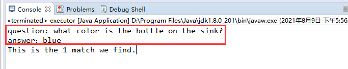

# Visual Question Answering by Pattern Matching and Reasoning

This repository contains two major parts:
- The word graph generation algorithm based on a given question;  
- The graph matching algorithm based on a word graph and a scene graph.

Part 1 >>> Word graph generation

- 1-1) cd src/
- 1-2) run Python parse.py

The generated word graphs will be saved in src/Data/word_graph.

Part 2 >>> Graph Matching

- 2-1) cd src/Query
- 2-2) run executor.java

The matching results will be shown as:  

## Evaluate
In our paper, the proposed approach is based on word graphs and scene graphs. The scene graphs can be obtained from the human annotations in GQA dataset or generated by scene graph generation models. Here we use the state-of-the-art model named KERN proposed in [1] for object relation detection and leverage ResNeXt [2] for attribute recognition.

The code for object relation detection (KERN) on GQA images was borrowed and modified from:
https://github.com/yuweihao/kern

The code for attributes detection (ResNeXt) was from:
https://github.com/facebookresearch/ResNeXt

To evaluate the proposed method:
1.Obtain scene graph of a given image.
2.Generate word graph of a given question.
3.Execute graph matching to get the result.

## Environment
python:3.6.4  

pip install -r requirement.txt  

jdk:1.8.0  

eclipse

## References
> [1] Chen, T., Yu, W., Chen, R., Lin, L.: Knowledge-embedded routing network for scene graph generation. In: Proceedings of the IEEE Conference on Computer Vision and Pattern Recognition. pp. 6163{6171 (2019) 3.1, 7.1  
> 
> [2] Xie, S., Girshick, R., Doll´ar, P., Tu, Z., He, K.: Aggregated residual transformations for deep neural networks. In: Proceedings of the IEEE conference on computer vision and pattern recognition. pp. 1492{1500 (2017) 3.1
